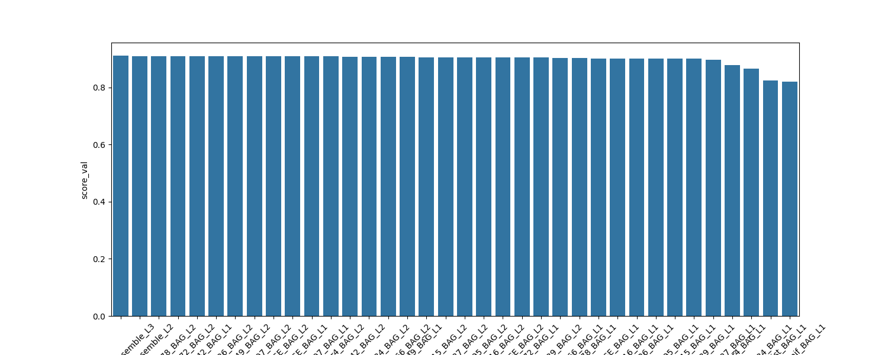
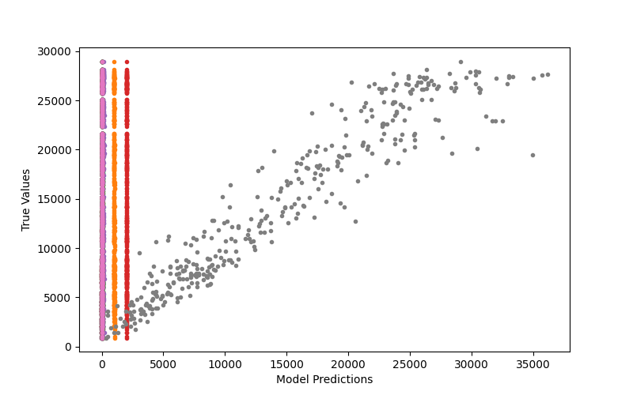

# Bike rental prediction based on weather forecast with Autogluon
> ⚠️ NOTE: It is recommended to run this project on a Conda environment.

This project uses Autogluon to help train all different kinds of models and find which model best suits the purpose for this bike rental prediction.

In this project, Autogluon will use L2 Regression (a.k.a Ridge Regression) to train the models.
The models trained by Autogluon will predict Divvy's Bike Rental Dataset based on the weather forecast.

> If you would like to generate your own dataset, store the weather dataset by Visual Crossing into the `chicago_weatherdata` folder and the Divvy Bicycles trip dataset into the `divvy_tripdata` folder. After that, run the `create_dataset.sh` command.

The source code for the model prediction in the [Bike Rental Predictor](./Bike%20Rental%20Predictor.ipynb) notebook file.

Here are the results you will get from this project:

Here are the features you need to take note before testing the model's prediction:

| Feature            | Description                 | Data Type | Unit of Measurement          |
|--------------------|-----------------------------|-----------|------------------------------|
| week               | The week for the date       | Integer   | Not Specified                |
| day                | The day for the date        | Integer   | Not Specified                |
| month              | The month for the date      | Integer   | Not Specified                |
| year               | The year for the date       | Integer   | Not Specified                |
| temp               | The weather temperature     | Float     | Degrees Fahrenheit           |
| dew                | The weather dew point       | Float     | Fahrenheit                   |
| humidity           | The weather humidity        | Float     | Percentage (0-100)           |
| precip             | The weather precipitation   | Float     | Inches                       |
| snowdepth          | The weather snow depth      | Float     | Inches                       |
| windgust           | The weather wind gust       | Float     | Miles Per Hour               |
| windspeed          | The weather wind speed      | Float     | Miles Per Hour               |
| sealevelpressure   | The sea level pressure      | Float     | Millibar                     |
| cloudcover         | The cloud coverage          | Float     | Percentage (0-100)           |
| visibility         | The visibility of the area  | Float     | Miles Per Hour               |
| solarradiation     | The radiation of the sun    | Float     | Watts Per Square Meter       |
| solarenergy        | The energy from the sun     | Float     | Millijoules Per Square Meter |
| uvindex            | The sun's ultraviolet index | Float     | Not Specified                |

Here are a list of applications that bike rental companies like Divvy can use with this project:
- Bike distribution (companies can balance the distribution of bikes to areas with better weather)
- Weather adjustments (if the weather for an area is not suitable for bike renting, companies can use this to close down those areas to save costs)
- Better Bike Availability (users can benefit from more available bikes, such as during peak hours)